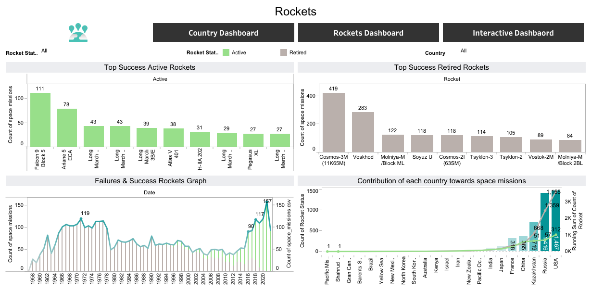

# Space Missions Data Analysis

## Dashboard Preview
These screenshots provide a snapshot of the insights generated from the space missions dataset.

## Interactive Dashboard
You can interact with the live dashboard here:
**[View Interactive Dashboard on Tableau Public](https://public.tableau.com/app/profile/sukhjeet.singh5355/viz/SpaceMissionsDataAnalysis_16831441771950/Worldinfomartion#1)**

## Key Insights
- **Historical Trends:** Visualization of the rapid growth in mission frequency.
- **Geopolitical Analysis:** A look at how different countries have dominated space exploration over various decades.
- **Mission Success:** Analysis of the technological advancements reflected in mission outcomes.
